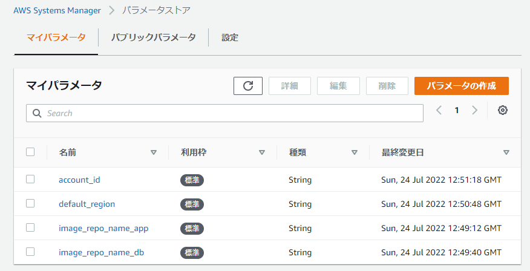
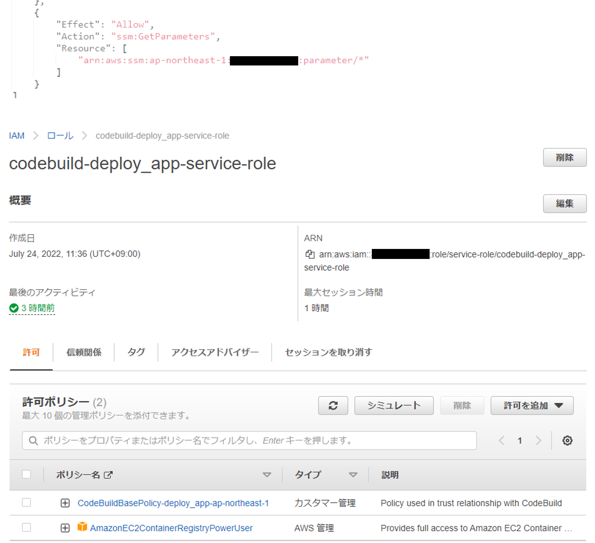
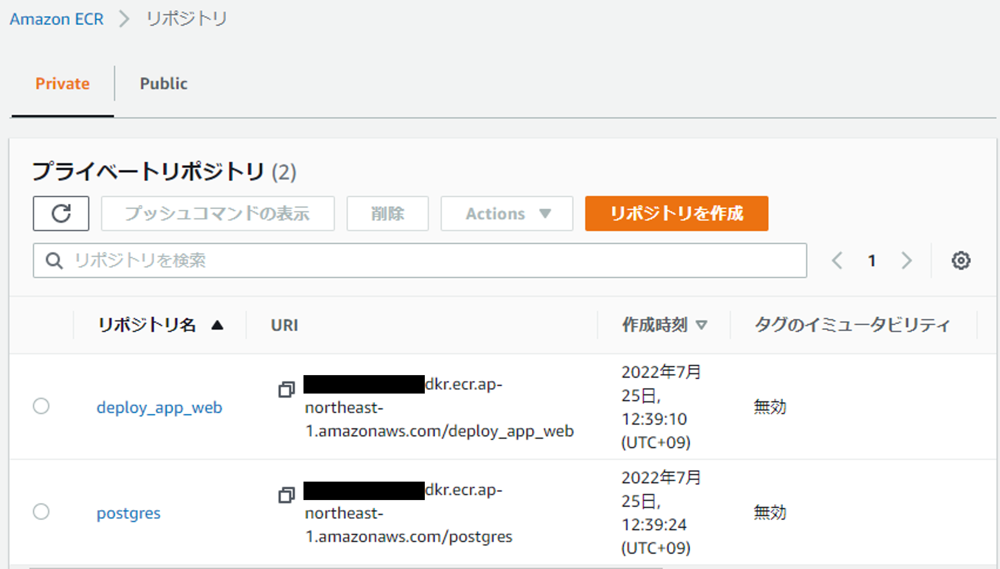

# CodeBuild
## 概要
- docker-composeを使用したアプリケーションをgithubからコードを取得しbuild
- build後にECRへイメージをプッシュ

概要図

## 準備が必要なもの
- github上の任意のdocker-composeアプリケーション
  - 今回はRailsアプリケーションを使用([作成方法](Application.md)) 
- AWSアカウント


## buildspec.ymlの作成
CodeBuildはbuildspec.ymlを読み込んでbuildを行う。
記述方法は[ドキュメント](https://docs.aws.amazon.com/ja_jp/codebuild/latest/userguide/build-spec-ref.html)参照
記述が完了したら、再度github上にpush
- [buildspec.yml](../buildspec.yml)


## パラメータストアの設定
buildspec.yml内のparameter-storeはAWS System Mnagerのパラメータストアを参照する
buildspec.ymlで指定した文字列と同じものを設定する



## CodeBuildの設定
以下の設定で十分

| 設定大項目 | 小項目| 設定値 | 備考 |
| :--: | :--: | :--: | :--: |
| プロジェクト設定 | プロジェクト名 | 任意 | |
| ソース | ソースプロバイダ | GitHub | 接続が完了していなければOAuthで接続表示に従えばok|
|| リポジトリ | アプリのリポジトリURL ||
| 環境 | 環境イメージ | マネージド型イメージ ||
|| オペレーティングシステム| Amazon Linux | Ubuntuでも可 |
|| ランタイム | standard | オペレーティングシステムを選ぶと出てくる|
|| イメージ | 最新のもの | ランタイムを選ぶとでてくる |
|| ロール名 |デフォルトで作られるまま ||
| Buildspec | ビルド仕様 | buildspecファイルを使用する||


## ロールの設定
デフォルトのロールでは
- System Manager
- ECR
への権限がないため、ロールを編集

1. IAMを開く
2. codebuildで作成したロールがあるので選択
3. 以下の通り編集
   - System Managerのアクセス許可(カスタムポリシーに追記)

    ```
    {
      "Effect": "Allow",
      "Action": "ssm:GetParameters",
      "Resource": [
          "arn:aws:ssm:(your-region):(your-account-id):parameter/*"
      ]
    }
    ```

    - ECRのアクセス許可 (AWS管理ポリシーを付与)
       - ```AmazonEC2ContainerRegistryPowerUser```をアタッチ	


## ECR リポジトリの作成
- buildspec.ymlで指定した名前($IMAGE_REPO_NAME_APPの値)と一致するようにリポジトリを作成
- 作成の際はプライベートでよい



## 実行
- CodeBuildの画面からビルドの実行

